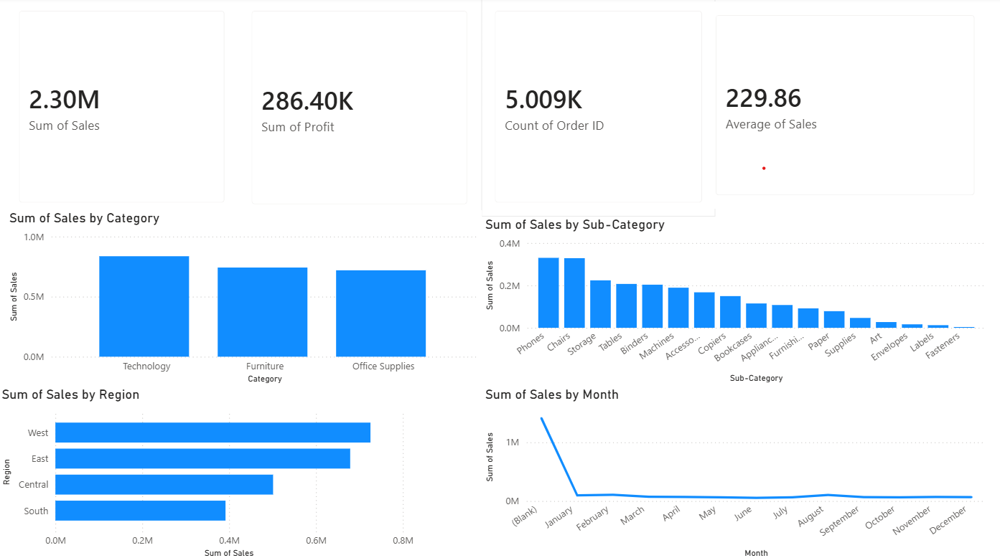

# E-Commerce Sales Analytics Dashboard

## Project Overview
This project analyzes e-commerce sales data using Power BI to identify sales trends, regional performance, and product category insights.

## Tools Used
- Power BI
- Excel/CSV
- Data Visualization
- Data Analysis

## Dashboard Features
- Total Sales KPI
- Total Profit KPI
- Total Orders KPI
- Average Sales KPI
- Sales by Category
- Sales by Sub-Category
- Sales by Region
- Monthly Sales Trend

## Key Insights
- Technology generated the highest sales.
- West region contributed the highest revenue.
- Phones and Chairs were among the top-selling sub-categories.
- Sales trends can be monitored over time using the dashboard.

## Project Structure
ECommerce-Sales-Dashboard/
├── Dataset/
├── Dashboard/
├── Screenshots/
└── README.md

## Screenshot

## Dashboard Screenshot

